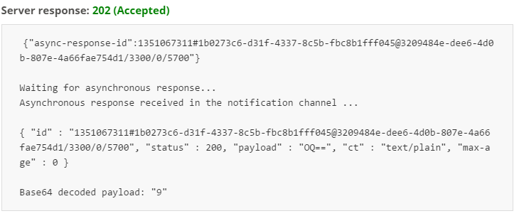

# mbed-client-withPIR

This is a simple example of mbed client with PIR sensor working for motion detection with mbed OS (linux version is not provided here. You can try it by yourself). You may need to take a look at [mbed-client-quickstart](https://github.com/ARMmbed/mbed-client-quickstart) first to finish the device registration.

The application:

* Registers with mbed Device Connector.
* Gives mbed Device Connector access to its resources (read and write).
* Records the number of clicks on the device’s button as well as motion detected by [PIR sensor](http://www.seeedstudio.com/wiki/PIR_Motion_sensor_module#Introduction) and sends the number to mbed Device Connector.
* Lets you control the state of PIR sensor and blink pattern of the LED on the device (through mbed Device Connector).

## Application resources

 Five [resources](https://docs.mbed.com/docs/mbed-device-connector-web-interfaces/en/latest/#the-mbed-device-connector-data-model) are included:

* `Button (3200/0/5501)`. Number of presses of SW2 (GET).
* `LED Blink (3201/0/5850)`.Blink function, blinks `LED1` when executed (POST)
* `Blink Patter (3201/0/5853)`. Used by the blink function to determine how to blink. In the format of `1000:500:1000:500:1000:500` (PUT).
* `PIR State (3300/0/5700)`. Pir state function, turn PIR sensor on or off by click the corresponding buttons (POST).
* `Motion Detection (3300/0/5701)`. Number of motion detected by PIR sensor (GET).

## Required hardware

* An [FRDM-K64F](http://developer.mbed.org/platforms/frdm-k64f/) board with [PIR sensor](http://www.seeedstudio.com/wiki/PIR_Motion_sensor_module#Introduction).
* An Ethernet connection to the internet.
* An Ethernet cable.
* A micro-USB cable.

## Required software

* An [ARM mbed account](https://developer.mbed.org/account/login/?next=/).
* [yotta](http://docs.yottabuild.org/#installing) - to build the example programs. To learn how to build mbed OS applications with yotta, see [the user guide](https://docs.mbed.com/docs/getting-started-mbed-os/en/latest/Full_Guide/app_on_yotta/#building-an-application).
* A [serial port monitor](https://developer.mbed.org/handbook/SerialPC#host-interface-and-terminal-applications).

## Monitoring the application

The application prints debug messages over the serial port, so you can monitor its activity with a serial port monitor. The application uses baud rate 115200.

**Note:** Instructions to set this up are located [here](https://developer.mbed.org/handbook/SerialPC#host-interface-and-terminal-applications).

After the bin file downloaded and your board reset, you should see the below messages:

```
In app_start()
IP address 10.164.3.62
Device name 1b0273c6-d31f-4337-8c5b-fbc8b1fff045

SOCKET_MODE : UDP
Connecting to coap://api.connector.mbed.com:5684

Registered object successfully!
```

**Note:** Device name is the endpoint name you will need later on [Testing the application](https://github.com/MaggieMei/mbed-client-withPIR#testing-the-application) chapter.

After you click the `SW2` button on your board you should see messages about the value changes:

```
handle_button_click, new value of counter is 1
```

When you put something in front of PIR sensor, it will detect the motion and send you the messages like this:

```
Hello! I've detected 1 times since reset
```

By experiments you will find the sensor is really sensitive.

## Testing the application

1. After device registration finished, go to [My devices > Connected devices](https://connector.mbed.com/#endpoints). Your device should be listed here.
2. Press the `SW2` button on the device a number of times (make a note of how many times you did that).
3. Go to [Device Connector > API Console](https://connector.mbed.com/#console).
4. Enter `https://api.connector.mbed.com/endpoints/DEVICE_NAME/3200/0/5501` in the URI field and click **TEST API**. Replace `DEVICE_NAME` with your actual endpoint name. The device name can be found in the `source/security.h` file, see variable `MBED_ENDPOINT_NAME` or it can be found from the traces [Monitoring the application](https://github.com/ARMmbed/mbed-client-quickstart#monitoring-the-application).
5. The number of times you pressed `SW2` is shown.
6. Enter `https://api.connector.mbed.com/endpoints/DEVICE_NAME/3300/0/5700` in the URI field and click **TEST API**.
7. The number of motion detected by the sensor is shown.
8. Press the `SW3` button to unregister from mbed Device Connector. You should see `Unregistered Object Successfully` printed to the serial port and LED starts blinking. This will also stop your application. Press the `RESET` button to run the program again.



**NOTE:** If you get an error, for example `Server Response: 410 (Gone)`, clear your browser's cache, log out, and log back in. 
**NOTE:** Only GET methods can be executed through [Device Connector > API Console](https://connector.mbed.com/#console). For the other methods check the [mbed Device Connector Quick Start](https://github.com/ARMmbed/mbed-connector-api-node-quickstart).
